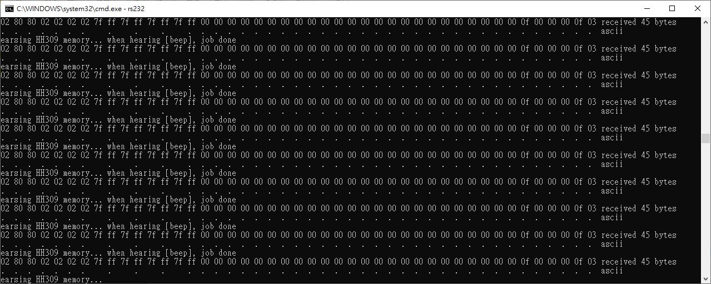

# HH309_logger_reader
HH309 temperature logger, RS232 reader template

ref: https://github.com/xiaolaba/artisan/blob/master/src/CommCENTER309Python3.py  

command "A", or 0x41, read 45 byte data  

##    
##    command = "\x4B" returns 4 bytes model number, 309 or 304
##    command = "\x41" returns 45 bytes (8x5 + 5 = 45) as follows:
##    
##    "\x02                               frame start, 1 byte
##    "\x80                               status of logger, bit7=Celsi/Faren, bit6=batter low, bit5=Hold, bit4=REL, bit3=T1-T2, bit2:1=Max/Min, bit0=recording
##     \xYY\                              status of logger, bit7=auto_off, bit6:1=not used, bit0=Memory_full
##     \xYY\xYY\xYY\xYY\                  T1_State to T4_State, 4 bytes, not used
##    "\xAA\xAA\xBB\xBB\xCC\xCC\xDD\xDD"  Temprerature T1 = AAAA, T2=BBBB, T3= CCCC, T4 = DDDD, 4 words; /10 or /1
##    "\x00\x00\x00\x00\x00\x00\x00\x00"  T1_rel to T4_rel, 4 words, high byte first
##    "\x00\x00\x00\x00\x00\x00\x00\x00"  T1_min to T4_min, 4 words, high byte first
##    "\x00\x00\x00\x00\x00\x00\x00\x00"  T1_max to T4_max, 4 words, high byte first
##    "\x00                               40th byte, Channel_OL_set, bit3:0=T4-T1
##    "\x00                               41th byte, Rel_OL_set, bit3:0=T4-T1                                
##    "\x00                               42th byte, Max_OL_set, bit3:0=T4-T1
##    "\x00                               43th byte, Min_OL_set, bit3:0=T4-T1
##    "\x0E                               44th byte, Channel_X1_X10, bit3:0=T4-T1, x1 or x10
##    "\x03                               45th byte, frame end, 1 byte
##    

command "e", erase memory

